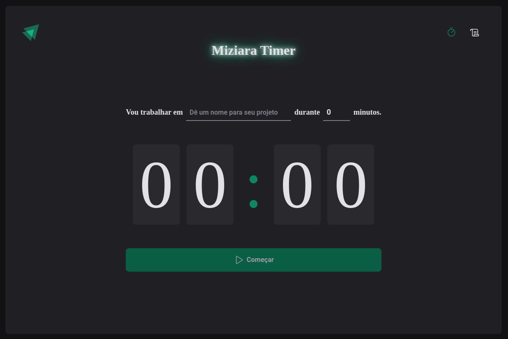

 
  

  &#xa0;

# Timer 

Este projeto um React. Ele utiliza várias dependências populares, como react-hook-form, react-router-dom, styled-components, entre outras.

## Instalação

Para instalar o pacote, você pode usar o gerenciador de pacotes npm ou yarn. Use um dos seguintes comandos:

## Scripts

O pacote contém os seguintes scripts para serem executados com npm:

`dev:` inicia um servidor de desenvolvimento com o Vite.

`build:` compila o código TypeScript e gera uma versão otimizada para produção.

`preview:` serve a versão otimizada gerada pelo script build para pré-visualização.

`lint:` executa o ESLint para verificar e corrigir problemas de linting
Dependências.

## Dependências
O pacote utiliza várias dependências para funcionar corretamente. Estas são as principais:

- `@hookform/resolvers:`biblioteca de resolução de validação para react-hook-form
- `date-fns:` biblioteca JavaScript para manipulação de datas
- `immer:` biblioteca JavaScript para trabalhar com estado imutável
- `phosphor-react:` conjunto de ícones SVG para React
- `react:` biblioteca para construir interfaces de usuário
- `react-dom:` biblioteca para manipulação do DOM em projetos React
- `react-hook-form:` biblioteca para construir formulários em React
- `react-router-dom:` biblioteca para navegação em projetos React
- `styled-components:` biblioteca para estilização em React
- `zod:` biblioteca para validação de esquemas de dados

## Licença
Este pacote está licenciado sob a licença MIT. Veja o arquivo LICENSE para mais informações.